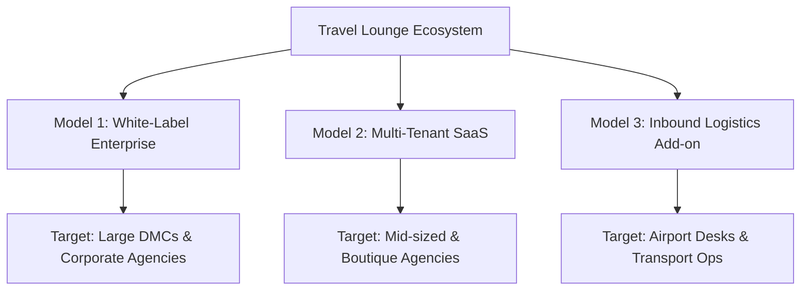

# Travel Lounge Ecosystem: Monetization & Go-to-Market Strategy

This document outlines the commercial roadmap, pricing structures, value propositions, and targeted outreach strategies to successfully sell and monetize the Travel Lounge digital ecosystem in the Mauritian and regional travel market.

---

## 1. The Value Proposition: Why Travel Lounge is a Premium Asset

To sell this ecosystem, you are not selling "code" or "software"; you are selling **operational modernization, transaction velocity, and direct-to-consumer (D2C) independence**. 

Here is how to pitch the individual layers of the ecosystem:

| Component | Strategic Value Pitch | Pain Point Solved |
| :--- | :--- | :--- |
| **B2B Admin Portal** | **The Operations Control Center**<br>Centralizes bookings, multi-tier occupancy pricing (Adults/Teens/Kids/Infants), and global site CMS settings. | "We manage hotel rates and seasonal room supplements across dozens of Excel sheets, leading to pricing errors and double-bookings." |
| **B2C Web App** | **High-Conversion SEO Machine**<br>Beautiful, fast, responsive booking engine with integrated flight search (GoLibé API) and custom "Tailor-Made" inquiry funnel. | "Our current site is slow, doesn't generate qualified inquiries, and we cannot easily run promotional campaigns without developer help." |
| **Native Mobile App** | **Pocket Concierge & Push Channel**<br>Real-time booking updates, personalized travel dashboard, and direct push-notification marketing. | "We have no way to retain customers once they return home, and email newsletters have very low open rates." |
| **Supabase Unified Backend** | **Single Source of Truth**<br>No data drift between web, mobile, and admin. Highly secure database with Row Level Security (RLS). | "Our customer databases are fragmented across booking files, email archives, and separate web databases." |

---

## 2. Tiered Monetization Models

To maximize revenue across your prospect list, we recommend offering **three distinct commercial pathways**:



### Model 1: The White-Label Enterprise License (High-Ticket)
*   **Target Audience**: Large DMCs, inbound tour operators, and airline GSAs (e.g., Mautourco, Solis Indian Ocean, SummerTimes, Rogers Aviation, Atom Travel).
*   **How it Works**: You deploy a dedicated instance of the ecosystem under their brand (e.g., `bookings.mautourco.com`), submit custom-branded mobile apps to their App Store/Google Play accounts, and bind it to their private Supabase backend.
*   **Pricing Structure**:
    *   **Setup/Implementation Fee**: $8,000 – $15,000 (covers custom branding, domain setups, iOS/Android developer account submissions, API binding, and staff training).
    *   **Annual License / Maintenance Fee**: $3,600 – $7,200/year (billed monthly at $299 – $599/month) for cloud hosting management, database backups, security patches, and support.
    *   **Add-on Commission**: 0.5% on transaction volumes passing through their B2C gateway (optional negotiation point).

### Model 2: The Multi-Tenant SaaS Platform (Recurring Revenue)
*   **Target Audience**: Mid-sized retail agencies, specialized consultants, and boutique networks (e.g., Silver Wings, Shamal Travels, Elite Voyage, Etnika Travel, Grand Bay Travel).
*   **How it Works**: You host the Travel Lounge platform on your own infrastructure as a shared multi-tenant SaaS. Agencies register and get a localized admin workspace, a standard web template connected to their sub-domain, and access to their customer CRM.
*   **Pricing Tiers**:
    *   **Starter ($49/month)**: Basic B2C website templates, CRM for up to 3 agents, manual inquiry intake (no live flight search).
    *   **Growth ($149/month)**: Live flight search (integrating their GoLibé credentials), 365-day seasonal Price Manager, up to 10 agents, automatic transactional email templates.
    *   **Pro / Scale ($349/month)**: Standard iOS/Android mobile app access for their customers, unlimited agents, API webhooks, and priority support.

### Model 3: The Airport Counter & Transport Console (Specialized)
*   **Target Audience**: Dedicated transfer operators, airport counter teams, and car rental/taxi services (e.g., Klik Moris, My Holidays, Coquille Bonheur, Mutt Taxi, Amigo Car Rental).
*   **How it Works**: Packaged as a lightweight booking console. Airport agents use it to register incoming arrivals, coordinate transfers, allocate drivers, and upsell excursions on the spot via mobile or tablet.
*   **Pricing Structure**:
    *   $99/month flat fee + $1.00 per booked transfer/excursion.

---

## 3. Targeted Sales Playbook by Prospect Segment

Based on the cleaned prospects database (`docs/cleaned_prospects.csv`), here is how to segment your sales approach:

### Segment A: Premium DMCs & Inbound Giants
*   **Key Leads**: Mautourco Ltd (Richard Robert), Solis Indian Ocean (Rheena Dookun-Adolphe), SummerTimes (Philippe Hitié), Coquille Bonheur, Connections Tourism, Rogers Aviation.
*   **Sales Strategy**: *The Enterprise Digital Transformation Pitch*. 
    *   Highlight the **365-Day Price Manager** and the **Elastic Booking Engine** (occupancy pricing for adults/teens/kids/infants) as the core assets.
    *   DMCs lose significant margin paying commissions to Booking.com, Agoda, and Expedia. Position the mobile app + web app as their "Direct Booking Capture System" to reclaim margins.
    *   Offer a high-touch, offline demonstration showing how their contract rates with local hotels (like Beachcomber or Lux) can be easily configured using the high-density grid.

### Segment B: Corporate & Outbound Retail Agencies
*   **Key Leads**: Atom Travel Service (Caroline Chen), Shamal Travels (Shezad Tincowree), Silver Wings (Andre Nairac), Itineris (Harel Mallac), Gold Air, Sky Air Travel.
*   **Sales Strategy**: *The Operation Velocity Pitch*.
    *   Focus heavily on the **GoLibé API Flight Search Integration** and the **Tailor-Made Inquiry Funnel**.
    *   Show how their front-line consultants can generate customized quotes and verify flight availability in under 3 minutes, compared to the manual legacy systems they use.
    *   Demonstrate the automatic email notification flow (booking confirmations, admin alerts, and automated 5-day pre-travel reminders) as a tool to drastically reduce administrative hours.

### Segment C: Specialized Airport & Transport Operators
*   **Key Leads**: Klik Moris, My Holidays, Emotions Destination Management, Amigo Car Rental.
*   **Sales Strategy**: *The Last-Mile Sales Pitch*.
    *   Pitch the platform as an "In-Destination Concierge".
    *   Show how their airport booths can instantly capture walk-ins, log payment status, and assign transfer details directly to a driver app or a shared real-time spreadsheet dashboard.

---

## 4. Next Steps to Close Your First Client

To convert this code asset into a revenue-generating business, execute the following steps:

1.  **Deploy a "Sales Demo" Sandbox**:
    *   Configure a clean instance of the web-app, mobile-app, and admin-portal on a demo domain (e.g., `demo.travellounge.mu`).
    *   Populate it with dummy Mauritian travel packages (e.g., a "5-Night Catamaran Package in Grand Baie" and a "Rodrigues Island Escape").
2.  **Run an Outreach Campaign using the Cleaned Prospect Database**:
    *   Utilize the contacts in `docs/cleaned_prospects.csv` (such as Shezad Tincowree at Shamal, Andre Nairac at Silver Wings, and Caroline Chen at Atom Travel).
    *   Send a personalized, value-driven email (see template below).
3.  **Offer a "Risk-Free Pilot"**:
    *   For your first 2 enterprise/retail prospects, offer a 30-day free pilot where you set up their branding and host the system for free. Use their feedback to refine the multi-tenant SaaS features before charging a license fee.

---

## 5. Cold Outreach Email Template

```text
Subject: Modernizing [Agency Name]'s Direct Booking & Rate Operations

Dear [Contact Person / Managing Director],

I hope this email finds you well. 

As the travel landscape in Mauritius shifts toward direct digital conversion and mobile retention, many agencies face the bottleneck of managing complex seasonal pricing grids and B2C channels across multiple disconnected systems.

We have recently finalized the development of "Travel Lounge" — a fully integrated, multi-channel travel booking and management ecosystem designed specifically for the regional market. It includes:
1. An SEO-optimized B2C Booking & Visa Web Portal.
2. A B2B Admin Console featuring a high-density, 365-day Price Manager (configured to handle adult, teen, and child room occupancy tiers effortlessly).
3. A Native Customer Mobile Concierge App (iOS/Android) for push marketing and customer engagement.
4. Seamless integration with GoLibé for live flight availability and ticketing.

We are currently selecting three premium partners in the Mauritian travel sector to experience a live demonstration and pilot the ecosystem on a white-labeled basis. Given [Agency Name]’s established reputation in [Location / Market Segment], we would love to show you how this stack can streamline your operations and drive higher direct bookings.

Would you be open to a brief 15-minute screen-share session next week to see the Price Manager and booking engine in action?

Best regards,

[Your Name]
Travel Lounge Platform Lead
[Your Contact Details]
```
